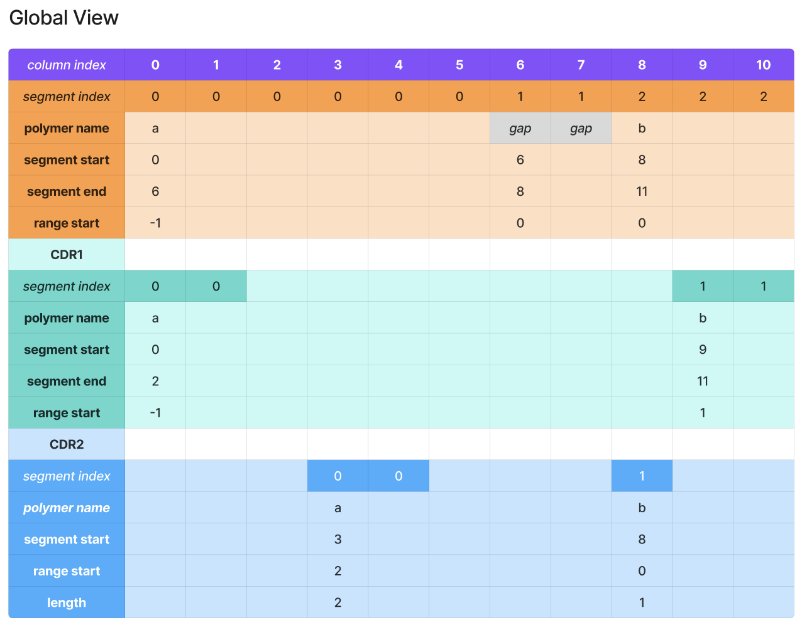
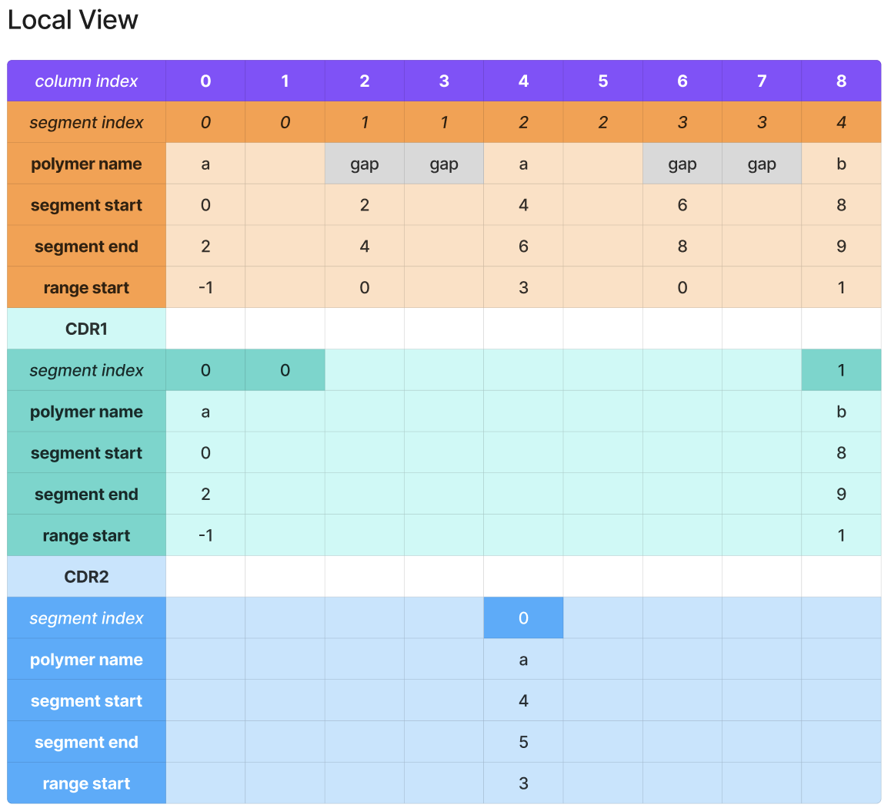
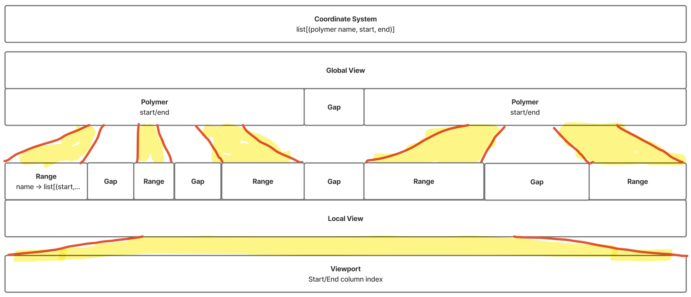
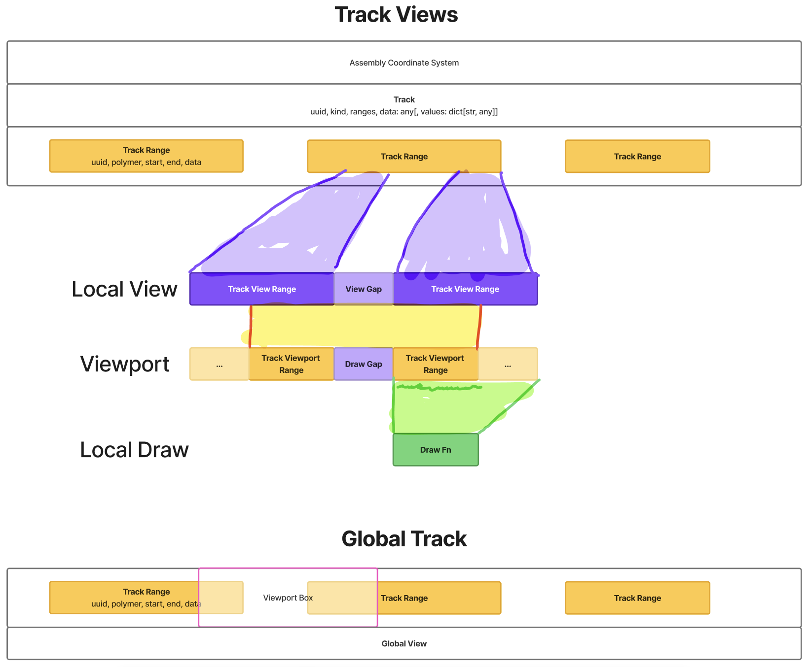

# Sequence Viewer

Low-level library for rendering (annotatated) sequences that provides highly customizable high-performance virtualized HTML Canvas based renderer combined with a power grid layout manager.

Most of the library is vanilla JS + RxJS. A default React wrapper is provided, but it can be used with other frameworks too.

## Code Structure

- `context.ts` is the entry point to the state management of the viewer
- `data/*` contains data models to represent individual parts of the viewer
- `model/*` contains the business logic of the viewer
- `renderers/*` contains default renderers for base representations (e.g., sequence string, rectangles for features, ...)
- `interactions/*` handles various UI interactions (e.g., panning, highlights, ...)
-  `utils/*` contains supporting code (e.g., interval artihmetic)
- `react/*` contains components and hooks that streamline the usage of the library when using React

## Basic Concepts

- `Data` is composed of:
    - `Coordinate System` that defines a "span" of a view
    - `Feature` maps a set of sequence ranges to arbitrarily shaped data, each feature has `kind`
    - `Track` combines one or more featu into a single row of the viewer. The features could either overlap or stack on top of each other
    - `Section` combines multiple tracks into a single view
- `Viewport` and `View` define the current focus of the viewer
- `Spec` defines:
  - `Layout` combines multiple sections and other other UI elements into a grid
  - `Theme` that defines coloring and other properties of the viewer
  - `Feature Render Callbacks` that define how individual feature `kind`s should be displayed to the user
- Viewer instance combines `Data`, `Viewport/View` and `Spec` into a `Context`
  - Both data and spec can be dynamically modified

## How It Works

### Data Representation

The library creates a compressed spreadsheet-like representation of the `Track`s and `Feature`s of efficiently represent the data.

#### Illustrative Example

```ts
CoodinateSystem = {
  polymers: [
    { name: 'a', start: -1, end: 5 } // 6, CRADLE
    { name: 'b', start: 0, end: 3 } // 3, BIO
  ]
  polymer_gap: 2
}

GlobalView = { a: [(-1, 5, 2)], b: [(0, 3, 0)]}
// 11 columns

Features = [{
  name: 'CDR1',
  ranges: { a: [(-1, 1)], b: [(1, 3)]}
}, {
  name: 'CDR2',
  ranges: { a: [(2, 4)], b: [(0, 1)]}
}]

LocalView = { a: [(-1, 0, 2), (3, 5, 2)], b: [(1, 2, 0)]}
// 9 columns
```




### Coordinate System



